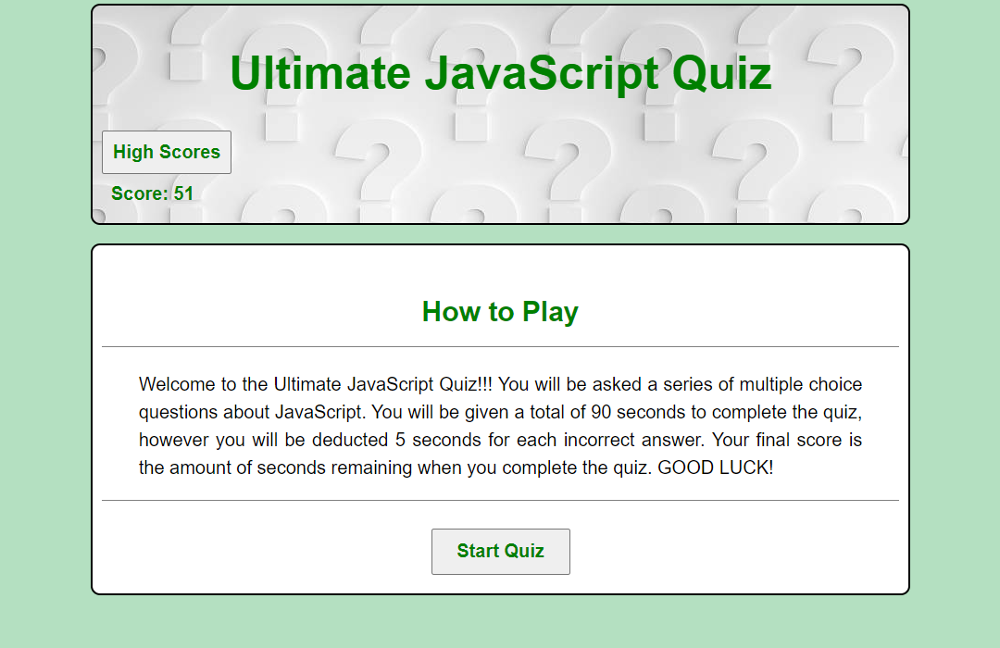
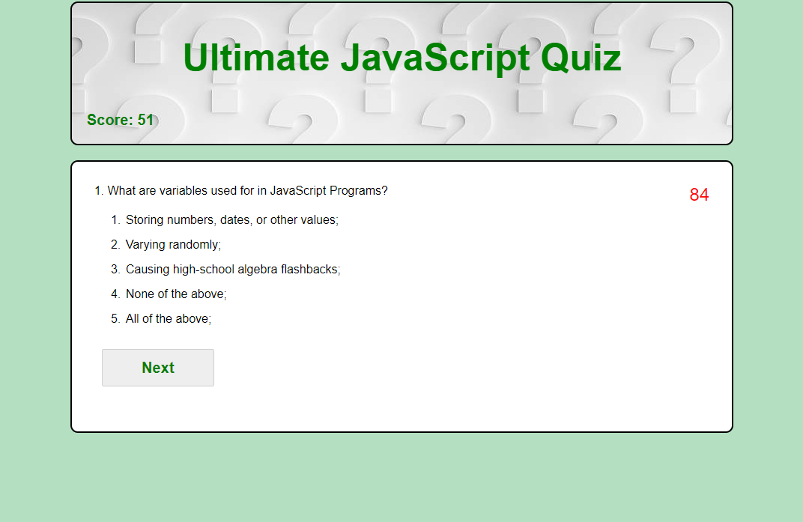
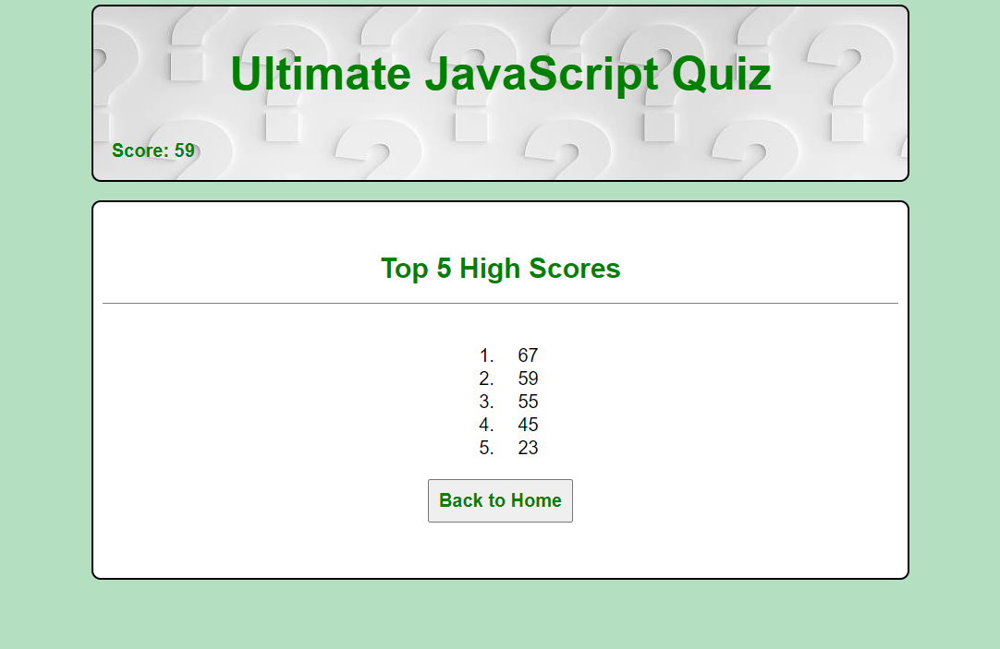

JAVASCRIPT TIMED QUIZ APP:

This week’s homework required me to build a timed coding quiz with multiple-choice questions. The app will run in the browser and will feature dynamically updated HTML and CSS powered by JavaScript code that I write. It will have a clean, polished, and responsive user interface.

The main criteria required for this are:

- When I click the start button, then a timer starts and I am presented with a question
- Once one question is answered then another question is presented
- If a question is answered incorrectly, then a time penalty is deducted from the remaining clock
- The game is over when all questions are answered or time reaches zero
- A high scores list is required to be recorded

IMAGES:

